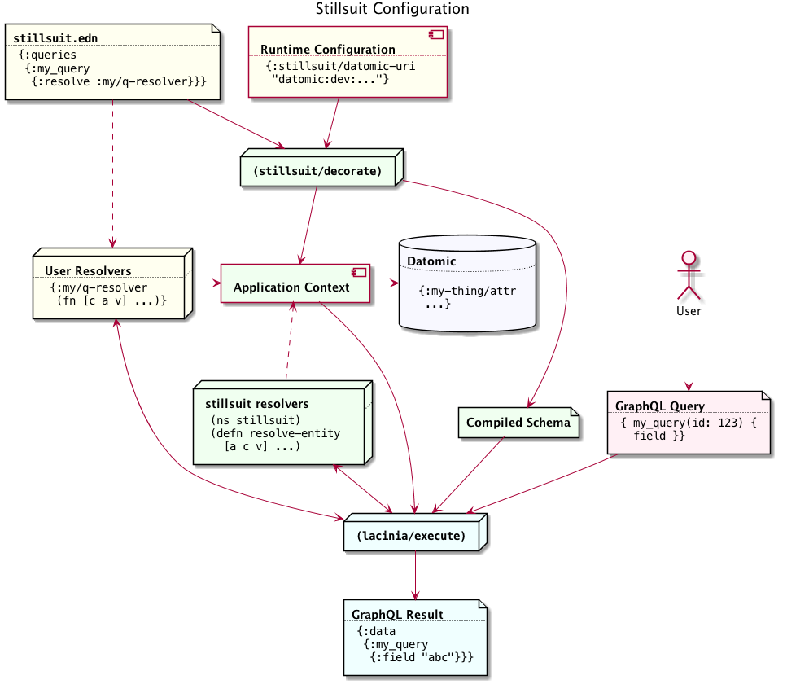

= Introduction to stillsuit
Tim Gilbert <tim@workframe.com>
v0.1, 2018-01-26
:sectanchors:

`stillsuit` is a library intended to be used with lacinia and datomic.

== Basic operation

The main interface to stillsuit is via the `(stillsuit/decorate)` function. This
function takes in a lacinia schema file, some maps referencing lacinia resolver
functions, and a configuration map. It returns a compiled lacinia file and an
application context; these parameters can be passed to `(lacinia/execute)` to
execute GraphQL queries.

[#img-overview]
.Stillsuit Overview


In the diagram above, the library user supplies the bits in yellow and stillsuit provides
the bits in green.

=== Sample code

Here's some sample code corresponding to the above diagram:

```clojure
(ns stillsuit-sample.seattle-manual
  (:require [com.walmartlabs.lacinia :as lacinia]
            [stillsuit.core :as stillsuit]
            [datomic.api :as d]))

;; Standard lacinia query definition
(def my-schema {:objects {...} :queries {:query_name {...}}})

;; Connection to datomic, which is added to the app context
(def datomic-conn (d/connect "datomic:dev://localhost:4334/seattle"))

;; Map of resolver names to resolver functions
(def my-resolvers {:resolver/name (fn [c a v] ...)})

;; Regular GraphQL query, ie from client code
(def my-query "{ query_name { field ... } }")

(defn -main [_]
  (let [;; This options map tells stillsuit where to look for stuff
        options   {:stillsuit/schema     my-schema
                   :stillsuit/config     {}
                   :stillsuit/connection (d/connect my-db-uri)
                   :stillsuit/resolvers  my-resolvers}
        ;; (stillsuit/decorate) is the main stillsuit interface.
        stillsuit (stillsuit/decorate options)
        ;; Stillsuit returns a compiled schema to the calling code
        compiled  (:stillsuit/schema stillsuit)
        ;; It also sets up an app context
        context   (:stillsuit/app-context stillsuit)
        ;; We pass these two values to (lacinia/execute) to resolve the query.
        result    (lacinia/execute compiled my-query nil context)]
    (println result)))
```

=== What stillsuit provides

`(stillsuit/decorate)` adds a bunch of stuff to the configuration you provide to
it before returning lacinia input data.

== Invoking stillsuit

stillsuit's public interface is fairly simple. The
http://docs.workframe.com/stillsuit/current/doc/stillsuit.core.html#var-decorate[`(stillsuit/decorate)`]
function accepts a stillsuit config, a datomic connection, and some references to resolvers
and bits of code. It returns a map containing the parameters you need to pass to lacinia's
http://walmartlabs.github.io/lacinia/com.walmartlabs.lacinia.html#var-execute[`(lacinia/execute)`]
function.

* TODO: Example call

* adding stuff to app-context

=== `(stillsuit/execute)`

As a convenience, stillsuit also includes a
http://docs.workframe.com/stillsuit/current/doc/stillsuit.core.html#var-execute[little wrapper function]
which calls `(lainia/execute)` for you from the result of `(stillsuit/decorate)`.

== Configuring stillsuit

(TBD)

* config file
** sample config or link to one
** loading the config

== The `:stillsuit/ref` resolver

The stillsuit _ref resolver_ is a lacinia
http://lacinia.readthedocs.io/en/latest/resolve/attach.html#resolver-factories[resolver factory]
which you can use to handle datomic `:db.type/ref` attributes (links from one entity to another).

With the ref resolver, you can tell stillsuit what type of entity you expect to be linked to
from the given reference. Note that datomic itself does not enforce any constraints on what
kind of entities may be referred to at a database level.

You refer to the ref resolver from a lacinia config file by specifying it like this:

```clojure
{:objects
 {:MyType
  {:fields
   {:myFieldName
    {:type    :MyOtherType
     :resolve [:stillsuit/ref options]}}}}}
```

The ref resolver's primary function is to handle `:db.type/ref` datomic attributes. However,
it will also work for regular primitive attributes like `:db.type/string` or `:db.type/long`,
which can be handy if you need to customize the GraphQL field name corresponding to a specific
datomic attribute.

=== Ref Resolver Options

The `options` value above is a map whose keys are all in the `:stillsuit` namespace. This section
lists what the options are.

==== :stillsuit/attribute

This option specifies the name of the datomic attribute to use for this GraphQL field name.

You can use it to override the default resolver's Datomic-to-GraphQL name translation,
so you can expose a datomic attribute with an arbitrary lacinia name.

===== Backrefs

One important use for the `:stillsuit/attribute` option is to expose
https://docs.datomic.com/on-prem/entities.html#basics[datomic back references]. Using the entity
API, we can navigate backwards along any link, so if a project has a `:project/author` ref
attribute, and we have a `person` entity, we can get to the set of projects which point to
that person via `(:project/_author person-ent)`. With stillsuit you can expose that back-reference
as a list of `:Project` objects on the `:Person` object like so:

```clojure
{:objects
 {:Person
  {:fields
   {:projects
    {:type    (list (non-null :Project))
     :resolve [:stillsuit/ref {:stillsuit/attribute    :project/_author
                               :stillsuit/lacinia-type :Project}]}}}}}
```

Note that we're returning a `(list (non-null :Project))` here, since a person can be the
author of many projects. This behavior is configurable via the `:stillsuit/cardinality`
option, see below.

==== :stillsuit/lacinia-type

This option specifies what lacinia type will be returned by a ref resolver. It currently needs to
be specified for every ref resolver, though it's redundant with lacinia's field `:type` definition.
We're looking at workarounds so that this could be omitted.

==== :stillsuit/cardinality

Datomic ref attributes inherently encode either many-to-one attributes (for `:db.cardinality/one`
ref attributes, since the backref is one-to-many), or many-to-many attributes
(for `:db.cardinality/many` ref attributes).

In your own data model, you might know that a given backref might have only a single entity
referring to it. For example, we may know that in our system a person will only ever be the
author of a single project.

In this case it can be convenient to specify the the link from `:Person` objects back to
`:Project` objects will only return a single `:Person` object, rather than a `(list)`
result which will only contain a single `:Person` object.

With stillsuit you can do so like this:

```clojure
{:objects
 {:Person
  {:fields
   {:projects
    {:type    :Project
     :resolve [:stillsuit/ref
               #:stillsuit{:attribute    :project/_author
                           :lacinia-type :Project
                           :cardinality  :stillsuit.cardinality/one}]}}}}}
```

The `:stillsuit/cardinality` option can have one of two values, corresponding to the
similarly-named datomic values.

===== `{:stillsuit/cardinality :stillsuit.cardinality/one}`

With this option, stillsuit will always return a single entity as the value of the field.
Note that if the datomic entity itself returns multiple items, stillsuit will choose an
item at random (via `(first)`) and include an error in its response.

===== `{:stillsuit/cardinality :stillsuit.cardinality/many}`

The reverse of the above option; stillsuit will always a list for the given value. Note that
this also returns an empty list for `nil` values.

==== :stillsuit/sort-key and :stillsuit/sort-order

When a ref resolver field returns multiple objects, you will often need to return the results
in a specified order. Datomic generally operates on set semantics, so the Entity API will
return values in a stable, but unsorted order.

Going back to the multiple-cardinality version of our example schema, here's what we'd
do if every person had a `(list)` of projects, and we wanted to sort them by project name:

```clojure
{:objects
 {:Person
  {:fields
   {:projects
    {:type    (list (non-null :Project))
     :resolve [:stillsuit/ref
               #:stillsuit{:attribute    :project/_author
                           :lacinia-type :Project
                           :sort-key     :project/name
                           :sort-order   :ascending}]}}}}}
```

The `:stillsuit/sort-key` field should be an attribute on the entities you are sorting.
`:stillsuit/sort-order` can be either `:ascending` or `:descending`.

NOTE: These two fields are fine for simple fields whose sort order you know ahead of time,
but if you need more complex behavior, including pagination, you'll probably want to write
a custom resolver.

== Writing Query Resolvers

(TBD)

https://github.com/workframers/stillsuit/blob/stillsuit-0.6.0/test/stillsuit/test/resolvers.clj[tests]

* how to write queries
** getting a db
** returning entities or entity lists
** sample query resolver for a single-entity
** sample for a multiple-entity query
** sort order of results

== Writing Mutation Resolvers

(TBD)

** getting a connection
** return an entity
** sample "create a thing" mutation
** sample "update a thing" mutation

== The Default Resolver

(TBD)

** lacinia to datomic name translation

== Stillsuit Custom Scalars

(TBD)

https://github.com/workframers/stillsuit/blob/stillsuit-0.6.0/test/resources/test-schemas/rainbow/lacinia.edn[examples]

** what's covered
** keywords
** dealing with time
** sample queries with args

== Stillsuit enums

Stillsuit comes with some facilities to support exposing datomic values as lacinia
http://lacinia.readthedocs.io/en/latest/enums.html[enum types].

We support two different flavors of enums, corresponding to two popular ways of modelling
enumerated values in a datomic schema:

1. _keyword enums_, where enum values are represented as `:db.type/keyword` attributes
2. _ref enums_, where enum values are represented as `:db.type/ref` attributes which
   refer to https://docs.datomic.com/on-prem/schema.html#enums[`:db/ident` values].

In either case, you can use the `:stillsuit/enum` resolver to translate from datomic
enum values to GraphQL ones and vice versa.

=== The two enum flavors

(TBD)

https://github.com/workframers/stillsuit/blob/stillsuit-0.6.0/test/resources/test-schemas/enums/datomic.edn#L1-L12[ref enum definition]

https://github.com/workframers/stillsuit/blob/stillsuit-0.6.0/test/resources/test-schemas/enums/datomic.edn#L23-L29[ref enum usage]

https://github.com/workframers/stillsuit/blob/stillsuit-0.6.0/test/resources/test-schemas/enums/datomic.edn#L14-L21[keyword enum definition]

https://github.com/workframers/stillsuit/blob/stillsuit-0.6.0/test/resources/test-schemas/enums/datomic.edn#L31-L37[keyword enum usage]

=== Specifying enums in the config file

(TBD)

Ref enums:
https://github.com/workframers/stillsuit/blob/stillsuit-0.6.0/test/resources/test-schemas/enums/lacinia.edn#L3-L13[definition],
https://github.com/workframers/stillsuit/blob/stillsuit-0.6.0/test/resources/test-schemas/enums/lacinia.edn#L30-L33[usage]

Keyword enums:
https://github.com/workframers/stillsuit/blob/stillsuit-0.6.0/test/resources/test-schemas/enums/lacinia.edn#L14-L24[definition],
https://github.com/workframers/stillsuit/blob/stillsuit-0.6.0/test/resources/test-schemas/enums/lacinia.edn#L38-L41[usage]

=== Resolving lacinia enums to datomic keywords

(TBD)

https://github.com/workframers/stillsuit/blob/stillsuit-0.6.0/test/stillsuit/test/enums.clj#L56[test]

=== The `:stillsuit/enum` resolver

** using the enum resolver
